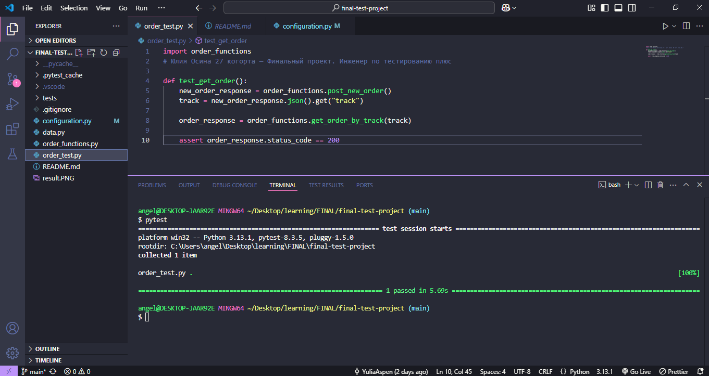

# Практический блок: вторая часть (Работа с базой данных)

## Работа с базой данных

**Задание 1: Проверка заказов в статусе «В доставке»**  
SQL-запрос:

```sql
SELECT c.login, COUNT(o.id) AS orders_in_delivery
FROM "Couriers" c
JOIN "Orders" o ON c.id = o."courierId"
WHERE o."inDelivery" = true
GROUP BY c.login;
```

Результат:  
| login | orders_in_delivery |
|--------|--------------------|
| ninja | 4 |
| osina | 4 |

---

**Задание 2: Проверка статусов заказов**  
SQL-запрос:

```sql
SELECT track,
  CASE
    WHEN finished = true THEN 2
    WHEN cancelled = true THEN -1
    WHEN "inDelivery" = true THEN 1
    ELSE 0
  END AS status
FROM "Orders";
```

Результат:  
| track | status |
|--------|--------|
| 460522 | 1 |
| 460522 | 1 |
| 456351 | 1 |
| 456351 | 1 |
| 24323 | 1 |
| 24323 | 1 |
| 381741 | 1 |
| 381741 | 1 |

## Автоматизация теста к API

Необходимо автоматизировать сценарий, который включает следующие шаги:

1. Клиент создает заказ.
2. Проверяется, что по треку заказа можно получить данные о заказе.

## Шаги автотеста:

1. Выполнить запрос на создание заказа.
2. Сохранить номер трека заказа.
3. Выполнить запрос на получения заказа по треку заказа.


